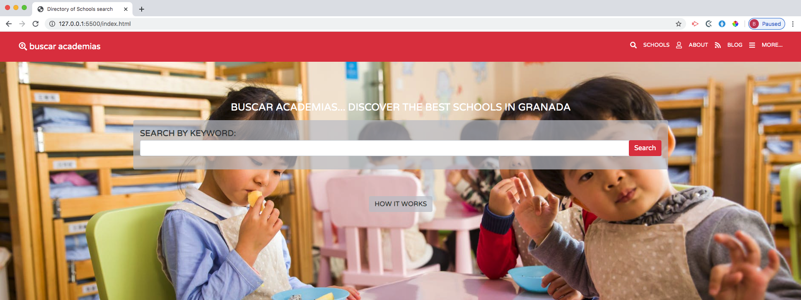
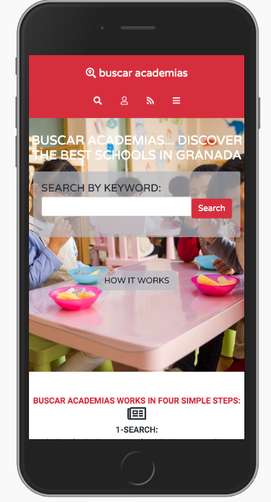
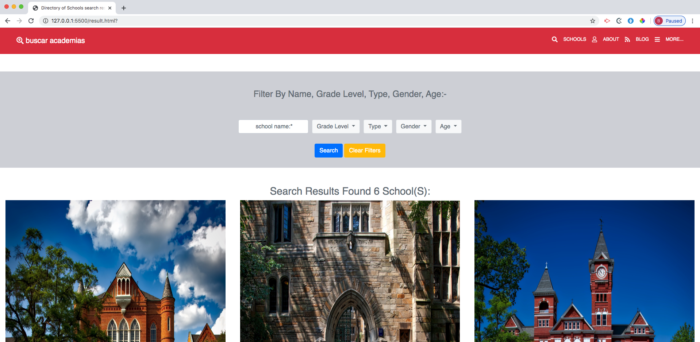
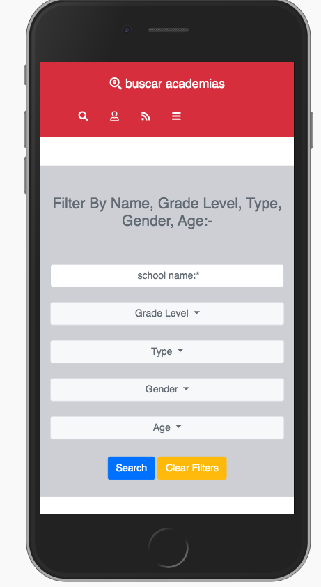
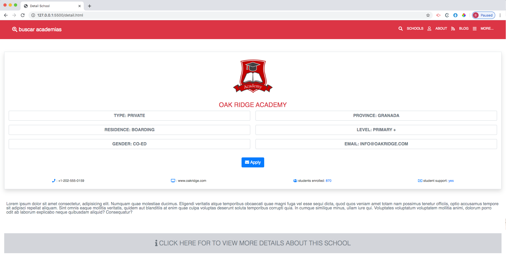
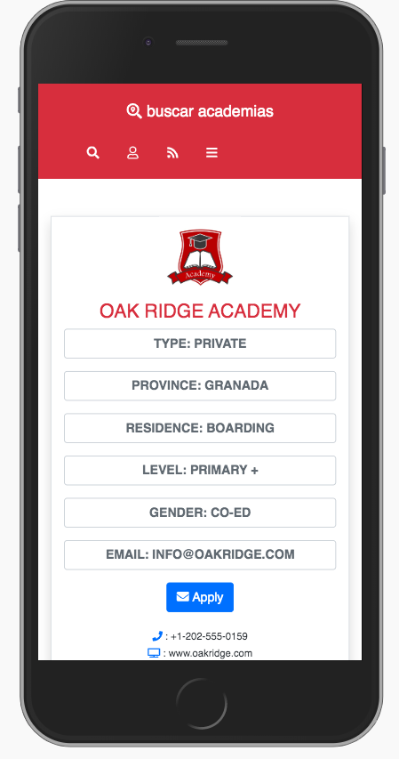

# Capstone-project-html
Capstone projects are solo projects at the end of the each of the Microverse Main Technical Curriculum sections. It is a real-world-like project built with business specifications  This project was at the end of the HTML & CSS curriculum section. The minimum required pages for this project were:
    - the main page or search page, which links to the results page
    - the search results page, with a list of schools each with a link to the detail school page
    - the detail school page
 
# Desktop Version of Main Page

# Mobile Version of Main Page

# Desktop Version of Search Results Page

# Mobile Version of Search Results Page

# Desktop Version of Detail School Page

# Mobile Version of Detail School Page

## Built With

- HTML 5
- CSS 3
- BOOTSTRAP 4

## Live Demo

[Live Demo Link](https://brittanyblake.github.io/Capstone-project-html/)

## Authors

👤 **Brittany Blake**

- Github: [@BrittanyBlake](https://github.com/BrittanyBlake)
- Twitter: [@bbcodes_](https://twitter.com/bbcodes_)
- Linkedin: [Brittany Blake](https://www.linkedin.com/in/brittany-blake-843951109/)

# Credit
- Design Created by <a href="https://www.behance.net/mathewnjuguna">Mather Njuguna</a> and  <a href="https://www.behance.net/aweSam"> Sam Achola</a>  on behance.
- See the Design Template <a href="https://www.behance.net/gallery/25563385/PatashuleKE">on behance</a>

## 🤝 Contributing

Contributions, issues and feature requests are welcome!

Feel free to check the [issues page](https://github.com/BrittanyBlake/Capstone-project-html/issues).

## Show your support

Give a ⭐️ if you like this project!

## 📝 License

This project is [MIT](lic.url) licensed.

